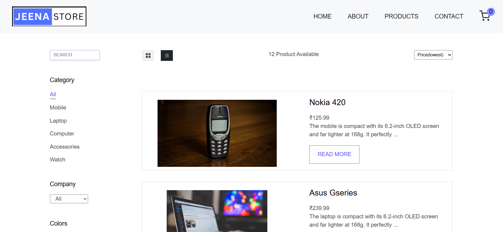

# 🛒 E-ComReactJs

[](LICENSE)
[](https://reactjs.org/)
[]()
[](https://github.com/Himanshusinghjeena/E-ComReactJs-main/pulls)

> **A modern, responsive E-Commerce web app built with React, Context API, and Styled Components.**

---

## 👀 Preview



---


## 📦 Features

- 🛍️ **Browse Products:** View a list/grid of products fetched from a live API.
- 🔍 **Filter & Sort:** Filter by category, company, price, and sort by price or name.
- ⭐ **Product Details:** See detailed info, images, and reviews for each product.
- 🛒 **Shopping Cart:** Add, remove, and update product quantities in your cart.
- 💾 **Persistent Cart:** Cart state is saved in localStorage.
- 📱 **Responsive Design:** Looks great on desktop, tablet, and mobile.
- ⚡ **Fast & Modern:** Built with React 18+, Context API, and Styled Components.
- 🧩 **Reusable Components:** Clean, modular codebase for easy maintenance.

---

## 🗂️ Project Structure

```plaintext
src/
  ├── components/      # Reusable UI components (Header, Footer, Product, etc.)
  ├── context/         # Context API providers for products, cart, filters
  ├── pages/           # Main pages (Home, Products, SingleProduct, Cart, etc.)
  ├── reducer/         # Reducer functions for state management
  ├── Helpers/         # Utility functions (FormatPrice, Star, etc.)
  ├── styles/          # Styled-components and global styles
  ├── App.js           # Main app with routing
  └── index.js         # Entry point, wraps app in context providers
```

---

## 🚀 Getting Started

### 1. Clone the repository

```bash
git clone https://github.com/Himanshusinghjeena/E-ComReactJs-main.git

```

### 2. Install dependencies

```bash
npm install
```

### 3. Start the development server

```bash
npm start
```

The app will run at [https://e-comreactjs.onrender.com]

---

## ⚙️ Tech Stack

- **React 18+**
- **React Router**
- **Context API + useReducer**
- **Styled Components**
- **REST API** (for products)
- **ESLint** (for code quality)

---

## 🙋‍♂️ Author

**Himanshu Singh Jeena**  
[GitHub: Himanshusinghjeena](https://github.com/Himanshusinghjeena)

---

## 📄 License

This project is licensed under the MIT License.

---

## ⭐️ Show your support

Give a ⭐️ if you like this project! 
